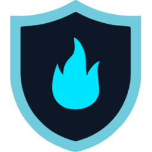

<p align="center">
  
</p>

# <p align="center">CyberManager — Ultra-Light Task Manager & Real-Time Process Control</p>

<p align="center">
  
  
  
  
</p>

<p align="center">
  <a href="https://github.com/CyberGems/CyberManager/releases/latest">
    
  </a>
  <a href="https://github.com/CyberGems/CyberManager/releases">
    
  </a>
</p>

A premium, high-performance and **ultra-lightweight task manager** for Windows, built for machines with thousands of processes. Virtualized, NT-native and zero-lag — the fluid alternative to Windows Task Manager.

*Free and open source (GPLv3) — no ads, no tracking.*

---

## ✨ Key Features

- **Virtualized Process Grid**: Renders only visible rows — 3000+ processes at 144fps.
- **NT-Native Engine**: `NtQueryInformationProcess` + differential snapshots for instant refresh.
- **Real-Time CPU %**: Delta-based calculation per-process, accurate and lightweight.
- **Instant Search & Filter**: By name, PID or path with zero blocking.
- **Process Control**: End task, end tree, suspend/resume, copy path, open folder, search online.
- **Premium CyberGems Chrome**: Frameless Mica/DWM 12px, CyberManager neon cyan theme + Dark/Light.
- **Always on Top** + bilingual EN/ES.

---

## 🛠️ Tech Stack

- **Platform**: Windows 10/11 (x64/ARM64)
- **Framework**: .NET 10 + WPF (Native UI)

```
CyberManager.slnx
├── src/CyberManager.Common/ -> Models, I18n, Settings (AppTheme.CyberManager)
├── src/CyberManager.Core/   -> ProcessCollector, ProcessActions (NT API)
└── src/CyberManager.UI/     -> Frameless WPF, ThemeManager, AboutWindow
```

---

## 🚀 Building

```powershell
dotnet build
dotnet run --project src/CyberManager.UI/CyberManager.UI.csproj
```

---

## ❤️ Donate

**CyberManager** is a personal open-source project within the **CyberGems** suite. I've spent thousands of hours building and refining it — both for my own use and to share premium-quality software with the world for free.

If you'd like to support this work, a donation would mean a lot. Thank you! 🙏

<p align="center">
  <a href="https://www.paypal.com/donate/?hosted_button_id=M4PY3UPJA5Y6Q"></a>
  <a href="https://ko-fi.com/cybergems"></a>
  <a href="https://buymeacoffee.com/cybergems"></a>
</p>

<div align="center">

<details>
<summary><b>Crypto donations (BTC, ETH, USDT, LTC) — click to view addresses</b></summary>

<div align="left">

| Asset | Network | Address | QR |
|---|---|---|---|
|  **BTC** | Bitcoin | `bc1q5mxzz05nmvsheqzx7970euswta3fksxzcfzag4` |  |
|  **ETH** | Ethereum (ERC20) | `0x79b703Ec0f77493679Fcd280aF3b983E20c580B8` |  |
|  **USDT** | Ethereum (ERC20) | `0x79b703Ec0f77493679Fcd280aF3b983E20c580B8` |  |
|  **USDT** | BNB Smart Chain (BEP20) | `0x79b703Ec0f77493679Fcd280aF3b983E20c580B8` |  |
|  **USDT** | Tron (TRC20) | `TSVbSk1HSyZ1NprCnAYiw56ECwXgH887mD` |  |
|  **LTC** | Litecoin | `LWGnEHgcFCE2BRkzLnsdPDD8Y8ZeDK577X` |  |

> ⚠️ Send only the selected asset on the indicated network. Using the wrong network will result in permanent loss of funds.

</div>

</details>

</div>

## License

GPLv3 — see [LICENSE](LICENSE).

<p align="center">Made by <a href="https://cybergems.org">CyberGems</a></p>
